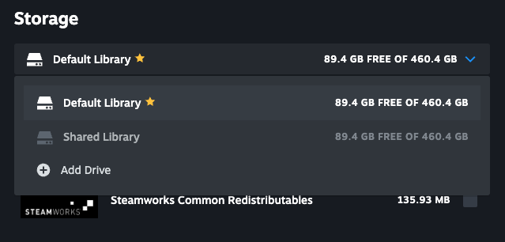
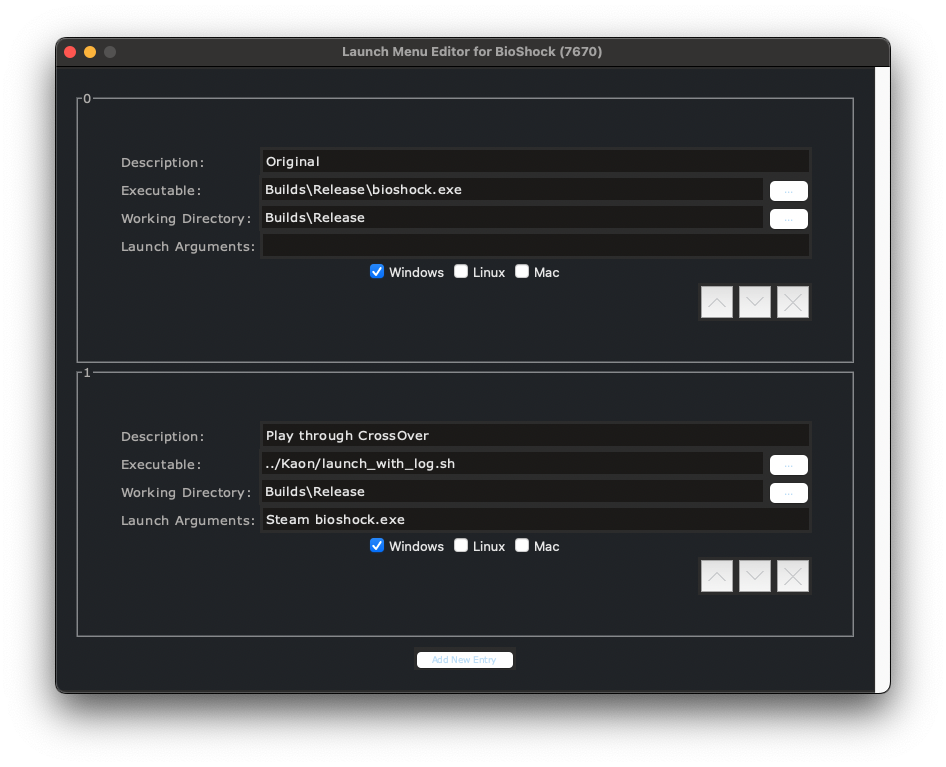

# Introduction

Kaon is an preliminary set of configurations, tools, and instructions for use with the macOS Steam client which allows Windows games to be _more easily_ installed and run (via CrossOver or Wine) while still making as much as possible use of the the native macOS Steam client. It's vaguely reminiscent of the Linux Steam client's Steam Play & Proton integration, but with a large number of hacky rough edges.

#### TL;DR
 * Have a working macOS Steam client installation, and a working CrossOver installation with the Windows Steam client installed in its own bottle (e.g. a Bottle name "Steam", referred to as \<wine-bottle\> in these instructions). Both installations should be on the same volume of your Mac.
 * Configure the macOS Steam client to think its user interface and Install/Play logic are on Windows by putting the line `@sSteamCmdForcePlatformType windows` into a new file named `~/Library/Application Support/Steam/Steam.AppBundle/Steam/Contents/MacOS/steam_dev.cfg`
 * Connect the Windows Steam client's default library to the macOS Steam client as a shared library. This takes a few steps to convince the macOS Steam client since it works hard to prevent two libraries from existing on the same volume -- detailed instructions below.
 * Copy the `scripts` directory of this project into your shared library (for example to `~/Library/Application Support/CrossOver/Bottles/<wine-bottle>/drive_c/Program Files (x86)/Steam/steamapps/common/Kaon`).
 * Install pyton3.11 and its dependencies and use the modified `steammetadataeditor` tool in this project to create additional Windows launch options for your games, adding a new Windows launch menu options to launch them through `../Kaon/launch_with_log.sh <wine-bottle> <executable>` for debugging launching issues, or through `../Kaon/launch_crossover.sh <wine-bottle> <executable>` once all is well.
 * When you press the Play button in the macOS client and choose the new launch option, the game will launch through the script into the specified CrossOver bottle, and the game will launch the Windows + CrossOver Steam client (if it's not already running) and communicate with it for SteamWorks (friends, achievements) and game ownership validation. Both the Windows Steam client and the macOS Steam client will show the game as running and allow hard-stopping the game.

 > **NOTE**: if the Windows + CrossOver Steam client is not already running, the macOS Steam client may time-out waiting for the game to launch and not show (x Cancel) UI as it will have lost track of the parent script's PID - just be patient or pre-launch the Windows + CrossOver Steam client.
 
 > **Also**, yes, it's a little annoying to have both the macOS and the Windows + CrossOver Steam clients visible and running. Once (if?) a functioning macOS-aware Wine `lsteamclient.dll` based on Proton's Linux `lsteamclient` is built (and this project includes the `Proton_9.0/lsteamclient` project as a subtree here to facilitate investigations and contributions), it should be possible to install it as a SteamWorks client API bridge within CrossOver to prevent the Windows Steam client from needing to be launched, visible, or even (possibly) installed. It should also be possible to avoid the shared library step for the macOS Steam client (TBD) although likely a bridge between CrossOver's environment and the macOS file-system of some sort will be needed to make path recognition work properly, and the Windows + CrossOver client may be required to resolve and update game SDK dependencies (DirectX, MSVC runtime, etc). It's not currently clear if the Steam Game Overlay, video recording, and other dynamic-library-injected features could currently work on macOS through `lsteamclient`'s current mechanisms or if there is specific logic baked into the Linux Steam client for Steam Play which facilitates this in a different way -- in SteamOS and Proton there is a whole different screen composition and input redirection layering that likely obviates the standard dynamic library injection that the Windows and macOS Steam clients use to interpose the graphic overlay and to interpose input management.

## Background

[Steam Play](https://steamcommunity.com/games/221410/announcements/detail/1696055855739350561) integrates compatibility tools, and specifically Proton as a Windows-to-Linux and DirectX-to-Vlukan compatibility tool into the purchase, download, configuration, update, and launch options of the Linux Steam client's user interface - [see this community guide for details and screenshots to get a sense of the UI integration](https://steamcommunity.com/shdaredfiles/filedetails/?id=1974055703). SteamOS further integrates Steam Play when running on dedicated Steam Deck hardware. SteamOS on Steam Deck does not offer the ability to turn Steam Play off completely and appears to have more automatic per-game compatibility choices driven by developer configuration and Steam Deck verification metadata provided by developers and publishers.

[Proton](https://github.com/ValveSoftware/Proton]) is the default compatibility tool of Steam Play and SteamOS running on Linux and on the Steam Deck. It creates a containerized runtime and API translation layer for games to isolate them from the host Linux version and from the rest of the Linux Steam client's installation. Proton uses a customized Wine to translate Windows-API-based 32-bit/i386 and 64-bit/x86_64 executables utilizing OpenGL-, DirectX-, and Vulkan-based graphics APIs into Linux and Vulkan APIs on the host i386+x86_64 platform. Although you will find throughout Proton's open source projects vestigial references to macOS and `__APPLE__`, Valve ceased maintaining Proton and Steam Play integration on macOS soon after Proton's beta release, before Apple Silicon. The project's transition to containerized building with a fixed Steam Runtime has made the majority of the configuration and building of Proton's source unworkable on macOS. That is to say - you can't just build the Proton project for macOS.

When Steam Play is enabled in a client (currently Linux standalone and SteamOS/SteamDeck builds only), it forces the automatic installation of the [SteamPlay 2.0 Manifests](https://steamdb.info/app/891390/info/). This compatibility tool manifest ([see documentation here](https://gitlab.steamos.cloud/steamrt/steam-runtime-tools/-/blob/main/docs/steam-compat-tool-interface.md)) describes each of the installable versions of Proton (proton_experimental, Proton 9.0-4, Proton 8.0-5, etc), each of their dependent runtimes, and custom default configurations and settings for specifically tested applications (see the `app_mappings` section).

Steam Play enablement appears to change the visibility of the Install and Play user interface in the Linux Steam client's library, as well as the background updating processes of the Steam client. It enables installation of Windows-based game whenever there is a compatibility tool with `linux` in the `to_oslist` of the tool's manifest - and it changes the Play behavior to wrap the developer/publisher's Windows launch options (the executable, working directory, and launch options) to support redirection through matching compatibility tool.

In the current macOS Steam client, although it is possible to install and register a compatibility tool with `"to_oslist" "macos"` in its configuration by placing a `compatibiltytool.vdf` manifest such as this example:
```
"compatibilitytools"
{
  "compat_tools"
  {
	"crossover"
	{
	  "install_path" "."
	  "display_name" "CrossOver Compatibility Tool"
	  "from_oslist" "windows"
	  "to_oslist" "macos"
	}
  }
}
```
into your `~/Library/Application Support/Steam/Steam.AppBundle/Steam/Contents/MacOS/compatibilitytool.d/<tool-directory>/` directory, the additional Steam Play user-interface enablement and launch-redirection logic is not functioning, so compatibility tools on macOS are effectively ignored from a user experience perspective.

[CrossOver](https://www.codeweavers.com/crossover) is a macOS application built by CodeWeavers, the primary maintainers of Wine, which bundles a customized version of Wine for macOS. The application provides a launching and configuration UI for Wine as well as an application installation and configuration database for running applications within Wine "bottles" (distinct Windows translation "soft" containers). Although mainline Wine has incorporated many macOS-specific changes over the years, an important handful of macOS- and CrossOver-specific changes to support the macOS environment and the 32-bit i386 and 64-bit x86_64 translation on Intel and Apple Silicon Macs are kept in [a distinct patch-set](https://www.codeweavers.com/crossover/source), likely because they are so specialized to macOS they muddle the cross-platform nature of the overall code-base. Since important macOS and Apple Silicon changes are not part of main-line Wine, they are also not part of Proton's Wine, which is anothre reason Proton can't "just be built for macOS."

The CrossOver application additionally includes closed-source / proprietary configuration and support tools and a graphical user interface which simplifies using Wine for non-technical users. This is quite similar to how Steam Play integration in the Linux Steam client integrates closed-source UI and configuration meta-data.

## 1. Installing Windows games naturally
TL;DR Configure the macOS Steam client to think its user interface and Install/Play logic should reflect Windows as the host/client by putting `@sSteamCmdForcePlatformType windows` into `~/Library/Application Support/Steam/Steam.AppBundle/Steam/Contents/MacOS/steam_dev.cfg` and restarting Steam.

Now Steam will configure it's UI to offer the Install button for any Windows games you own which are listed in your Library and it will also enable the Play button. It will download and install only the Windows versions and keep them up-to-date. Any game you own with ONLY a macOS version on offer (only a macOS depot in the Steam back-end) will remain installed, though will not stay updated when the Steam client believes it is "Windows". Any game with both a macOS and a Windows version available on Steam will eventually be updated or cleared to install just the Windows version with this configuration unless you turn off updating the game until launch (and even then, it will update to the Windows version upon next launch). Part of Steam Play's logic in the Linux Steam client, which does not appear to be implemented in the macOS Steam client, is the ability to prefer the platform-native version of a game unless overridden - the brute force of setting the platform type via the `@sSteamCmdForcePlatformType` ConVar is not as nuanced as full Steam Play logic, and simply causes everything to go through the Windows install, update, and play paths.

### 1.1 Details
The documentation for the SteamCmd tool shows how you can [download non-macOS versions of games onto your Mac](https://developer.valvesoftware.com/wiki/SteamCMD#Cross-Platform_Installation) by setting the `@sSteamCmdForcePlatformType` ConVar to `windows`.
You can even do this without SteamCmd from the client console. Launch the macOS Steam client with a `-console` command-line argument, from a terminal:
```
open /Applications/Steam.app --args -console
```
or if Steam is already running, issue the following from a terminal:
```
open steam://nav/console
```
In the Steam client's terminal, you can now manually install the Windows versions of games you own, for example to install BioShock 7670: (paste commands one line at a time)
```
@sSteamCmdForcePlatformType windows
app_install 7670
```
Alas, though - there is instability to this Windows configuration when established after launch and without full Steam Play logic built in. First off, if a game has a native/macOS depot of any kind, even an empty one (and BioShock 7670 is just such a game), the next time the Steam client is run and before you get a chance to set `@sSteamCmdForcePlatformType windows` you may find the background updating process has emptied or "reaped" the installation folder or replaced it with the macOS version.

Additionally, you do not have the ability to install other games through the normal library installation UI - that UI was configured for platform type at launch, before the platform override ConVar was set by you in the console - you are stuck doing manual `app_install` installs from SteamCmd or from the console.

In a first attempt to get the ConVar at initial launch, I thought you might be able to use:
```
open /Applications/Steam.app --args -console "+@sSteamCmdForcePlatformType windows"
```
(be sure to quote correctly), and while looking at ConVars in the console appears to show it being set correctly at launch, the Library UI still does not show the ability to Install Windows games - the platform setting must be getting read for the Library's UI earlier than the command-line ConVars are parsed?

Fear not - we can get around this by creating the `steam_dev.cfg` file noted in TL;DR above.

> Note that putting this ConVar in the alternate `steam.cfg` file in your installation will not work - `@sSteamCmdForcePlatformType` is not an allowed ConVar in `steam.cfg` and will be ignored - it only works if placed in `steam_dev.cfg`. The downside to putting this setting in `steam_dev.cfg` can be that the presence of this file typically prevents on macOS the "initial bootstrap" step of the macOS Steam client (it triggers the command-line argument `-skipinitialbootstrap` which updates the Steam client). You may want to occasionally force a client update by removing this file for a single launch of Steam and then restoring it before the client gets a chance to "reap" all your Windows games installations away while running in macOS Steam client mode.

## 2. Connect macOS and CrossOver Steam Libraries
For now, this strange step is the most straightforward way to align the paths between the macOS Steam client and the Windows + CrossOver Steam client so games can communicate with the Windows + CrossOver Steam client for SteamWorks and ownership validation without per-game path reconciliation parameters passed to the wrapping scripts.

The end-goal you are after is to have a secondary non-default library for your macOS Steam client where you install Windows games which matches your Windows + CrossOver Steam client's default library - you're looking to eventually have your macOS Steam client's `~/Library/Application Support/Steam/steamapps/libraryfolders.vdf` file  look something like the following:

```
"libraryfolders"
{
		"0"
		{
				"path"          "/Users/<user-name>/Library/Application Support/Steam"
				"label"         "Default Library"
				...
		}
		"1"
		{
				"path"          "/Users/<user-name>/Library/Application Support/CrossOver/Bottles/<wine-bottle>/drive_c/Program Files (x86)/Steam"
				"label"         "Shared Library"
				...
		}
}
```
while your Windows + CrossOver's library at `~/Library/Application Support/CrossOver/<wine-bottle>/drive_c/Program Files (x86)/Steam/steamapps/libraryfolders.vdf` continues to look like the following
```
"libraryfolders"
{
		"0"
		{
				"path"          "C:\\Program Files (x86)\\Steam"
				"label"         "Default Library"
				...
		}
}
```
To get to this state you need to take a series of intermediary steps:
* From the terminal, create and mount a temporary growable disk image. You're going to use this additional mounted "volume" to trick the macOS Steam client into allowing you to create an additional library that it thinks is on a secondary volume, and then you're going to edit its configuration to point to your Windows + CrossOver Steam client default library. To do this, from a terminal do the following:
```
cd ~/Desktop
hdiutil create -size 1gb -type SPARSE -fs apfs -volname Steam-Windows steam.dummy
hdiutil mount steam.dummy.sparseimage
```
* Launch your macOS Steam client and go to Steam > Preferences... and choose Storage. In Storage, in the Library drop-down list, choose `(+) Add Drive` option, and choose the `/Volumes/Steam-Windows` drive that is showing (it may be part of a list if you have additional volumes mounted).
* Now shut down the macOS Steam client and use a text editor to open the `~/Library/Application Support/Steam/steamapps/libraryfolders.vdf` file. Change the line that says
```
	"path"          "/Volumes/Steam-Windows/SteamLibrary"
```
to the path to your Windows + CrossOver Steam client's library folder, e.g.
```
	"path"			"/Users/<user-name>/Library/Application Support/CrossOver/Bottles/<wine-bottle>/drive_c/Program Files (x86)/Steam"
```
* Reboot the macOS Steam client and once again go to Steam > Preferences... and choose Storage to confirm the connection to this library. It might be useful for your sanity to use the Library rename function (hiding in the `...` menu when you have a library selected) to name your Windows + CrossOver library something like "Shared Library" and your normal Steam library "Default Library", as shown here:



* You can now unmount and delete the temporary sparse disk image / volume you created to trick the macOS Steam client:
```
cd ~/Desktop
hdiutil unmount /Volumes/Steam-Windows
rm steam.dummy.sparseimage
```

> Note: it doesn't appear that you can skip the dummy volume step by just manually adding this entry to your `libraryfolders.vdf` file - the Steam client does a little bit of validation or checksumming (?) of some kind when setting up a new library and seems to wipe out additional library entries in `libraryfolders.vdf` which it didn't initially make itself. Happy to be proven wrong here, this step is annoying.

## 3. Functioning Play Buttons
Since Step 1 you already have the Play button available in your Library for installed Windows games, but it's not doing what you want because it's trying to launch the Windows executable from one of the developer-provided launch options in the application's metadata/manifest/configuration. But because of Step 2 you have aligned the paths which the macOS Steam client thinks of as truth and the paths which the Windows + CrossOver Steam client thinks of as truth, so you're ready to get things wired up.

Your first step is to copy the `scripts` directory of this project into a new folder in your your shared library
```
mkdir "~/Library/Application Support/CrossOver/Bottles/<wine-bottle>/drive_c/Program Files (x86)/Steam/steamapps/common/Kaon"
cp scripts/* "~/Library/Application Support/CrossOver/Bottles/<wine-bottle>/drive_c/Program Files (x86)/Steam/steamapps/common/Kaon"
```
This places the `launch_with_log.sh` and `launch_crossover.sh` scripts into a known location which is consistent to reference from other game directories in the shared library for the next step where you add additional launch options to games you want to wrap up.
 
Now use the modified `steammetadataeditor` tool in this project -- which is derived from the [Steam-Metadata-Editor](https://github.com/tralph3/Steam-Metadata-Editor) tool -- to add a new launch option for a game. Be sure to have Steam-Metadata-Editor dependencies installed:
```
% brew install python@3.11 python-tk@3.11
```
Launch options are provided by game developers/publishers as part of the game's manifest in Steam's back end, and the manifests for ALL of your owned games are cached in the Steam client in the file `Steam/appcache/appinfo.vdf`. You can modify the cached manifest using `steammetadataeditor` and Steam will not overwrite your changes unless the manifest is updated by the developer/publisher. `steammetadataeditor` has a cool feature where it keeps a side-copy of just your changes and can re-apply them if the `appinfo.vdf` file is updated or deleted and recreated by Steam.

So, launch `steammetadataeditor` and type the name of the game you want to modify, then press the "Edit Launch Menu" button. Use the "Add New Entry" button to add a new Windows launch-option for each game to bounce them through `../Kaon/launch_with_log.sh <wine-bottle> <executable>` for debugging launching issues, or through `../Kaon/launch_crossover.sh <wine-bottle> <executable>` once all is well. Because of the way Steam quotes the Executable name when spawning child processes, you need to add the `<wine-bottle> <executable>` portion of the launch through the launch arguments, so your updated launch options list will look something like this:



Remember to use the Save button in the `steammetadataeditor` tool after you close the launch menu editor window! Rewriting this tool into a command-line script to automate these modifications so you could do `add_crossover_launch_option <wine-bottle> [<game-name> | <appid>]` instead of having to have python3.11 installed and run a GUI tool would be a great next step to simplify Kaon.

The `launch_with_log.sh` script will append to the `crossover_log.txt` log file in the Kaon directory. Looking at this log and at the macOS Steam client's `console_log.txt` and the Windows + CrossOver Steam clients `console_log.txt` file can help clear up launch and environment setup issues. CrossOver's Wine logs can be pretty handy, too!
 
### 3.1. Details
Play buttons are enabled in the macOS Steam client in two cases:
1. When `macos` is in the `oslist` list of supported platforms in a game's manifest and there is a valid macOS launch option, *or*
2. When the `oslist` contains just `windows` and the Steam client has been launched with an early enough `@sSteamCmdForcePlatform windows` ConVar.

The custom version of the `steammetadataeditor` included in this projects supports editing the `oslist` configuration data of an app for experimentation, but as noted above, having a Windows game installed when the background updating system is configured for macOS can cause it to delete the application _if_ there is are macOS depots available for the game. In the case of Bioshock/7670, for example, there is an empty macOS depot, and so its installation directory can get emptied out from under you. To see all of the configuration data for an application, from `steamcmd` or from the Steam client console, you can use `app_info_print <appid>`, for example:

```
] app_info_print 7670
AppID : 7670, change number : 27372237/0, last change : Mon Feb 10 12:54:06 2025 
"7670"
{
	"common"
	{
		"name"		"BioShock"
		"oslist"	"windows"
		...
	}
	...
	"config"
	{
		"contenttype"		"3"
		"installdir"		"Bioshock"
		"launch"
		{
			"0"
			{
				"executable"		"Builds\\Release\\bioshock.exe"
				"workingdir"		"Builds\\Release"
				"config"
				{
					"oslist"		"windows"
				}
			}
		}
	}
}
``` 

## Next steps

1. Creating a macOS-aware version of Proton's `lsteamclient` is an obvious next step to (possibly) simplify this configuration and avoid two Steam clients running at once. Building `lsteamclient` requires macOS-aware Wine tools and some tweaks to the interconnect which are exacerbated by Rosetta 2 translation and slight differences in protobuf packing IIRC. Anybody looking to contribute here might find some of the background on game<->Steam communication I wrote in [this reddit thread](https://www.reddit.com/r/macgaming/comments/1ifyx55/steamplay_proton_on_macos_research) useful.

2. Creating an easier-to-use / cmd-line version of the `steammetadataeditor` tool for tweaking `appcache.vdf` would simplify this configuration for casual users. Making it work with the current default `homebrew` python3.13 rather than needing to back up to python3.11 due to GUI dependencies would also simplify life.

3. Given all the background above, I suspect there is a path where you could have native macOS games and Windows + CrossOver games intermingled in your macOS Steam client library with a little more manual work for installs and updates than most folks might like. Something like:
   * Not booting the macOS Steam client in Windows mode (so removing the suggested `steam_dev.cfg` file)
   * Turning off auto-update of specific games you want to run through CrossOver in the macOS Steam client
   * Manually installing Windows games into the shared library from the console or SteamCmd using temporary `@sSteamCmdForcePlatform windows` just when you're installing/updating.
   * These days you can tell Steam only to not update a game until you run it to prevent background reaping (you can't turn it off from the GUI entirely anymore), but... last I checked it seems to be possible to make specific apps not update by marking their `appmanifest_<appid>.acf` file in the library read-only, e.g. `chmod -w "~/Library/Application Support/Steam/steamappos/appmanifest_7670.acf"` YMMV. But you could also just be sure to set `@sSteamCmdForcePlatform windows` in the console before you launch these specific Windows + CrossOver games and allow the client to update them if they have Windows updates.
   * Adding `macos` to the `oslist` of the Windows + CrossOver game's manifest in your macOS Steam client's `appinfo.vdf` and adding a macOS-specific launch option instead of an additional Windows launch option. This would give you a functioning Play button on macOS even though Install buttons would not work.

## Acknowledgements

Thanks to [scvairy on /r/macgaming](https://www.reddit.com/r/macgaming/comments/1ifyx55/steamplay_proton_on_macos_research) for bringing up this topic while I was between things. It reminded me to document more about how Steam, Proton, CrossOver, and Rosetta work with one another on macOS, as not a lot of people understand this whole tangle. It's cathartic to get this itch out of my brain, too.

Thanks to CodeWeavers for continuing to invest in CrossOver for macOS and for all their hard work over the years integrating MoltenVK, GPTk/D3DMetal, and now DXMT into the graphic stack and into games. It has been a pleasure working alongside you all for 10+ years!

Thanks to Bill Hollings, Baldur Karlsson, Dan Ginsburg, everybody at LunarG and many others in the community and at Valve for their ongoing work on MoltenVK and SPIRV-Cross to accelerate and broaden Vulkan and for supporting DirectX translation to Metal. What a long strange trip it continues to be.

Thanks to my friends & former colleagues at Valve who keep macOS Steam chugging, MoltenVK going, for making Proton awesome, and to my friends & former colleagues at Apple working on GPTk/D3DMetal, Rosetta, game controllers and GameTech and gaming as a whole - thanks for keeping the very tenuous dream alive.
